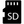

# Raspberry Pi

This repository contains a step-by-step guide and command-line tool to help you get started with your Raspberry Pi for several kinds of awesome projects like:

* Machine Learning and Deep Learning
* Image and video processing
* Speech processing

![Doc][release-doc-shield] ![License][license-shield] [![Twitter][twitter-shield]](https://twitter.com/Monsieur_Borges)

## Contents

[Requirements](./setup/requirements.md) - everything you need to get started with your Raspberry Pi.

[GPIO](./setup/GPIO.md) - the General Purpose Input/Output pins allow you to control and interact with the real world.

[SD card writing tools](./setup/install-os.md) - installing operating system images.

[Clone and shrink an SD image](./setup/clone-sd-card.md) - make a backup for hard times.

[Install the Raspberry Pi OS](./setup/install-os-raspberry-pi.md)

[Install Ubuntu Server](./setup/install-os-ubuntu-server.md)

[Remote Access](./setup/remote-access.md) - accessing your Pi remotely via SSH or VNC.

[Camera module](./setup/camera-module.md) - full HD 1080p photo and video.

[Install Python](./setup/install-python.md)

[Install OpenCV](./setup/install-opencv.md)

[Install Intel RealSense Library](./setup/install-librealsense.md)

## Author

* [Monsieur Borges](https://github.com/monsieurborges)

## License

The source code is licensed under the [MIT license](LICENSE.md).

The content of this project itself is licensed under the [Creative Commons Attribution 4.0 International](https://creativecommons.org/licenses/by/4.0).

[twitter-shield]: https://img.shields.io/twitter/follow/Monsieur_Borges?label=Follow&style=social
[release-doc-shield]: https://img.shields.io/badge/Doc-13--Aug--2020-blue
[license-shield]: https://img.shields.io/github/license/monsieurborges/raspberry-pi.svg
