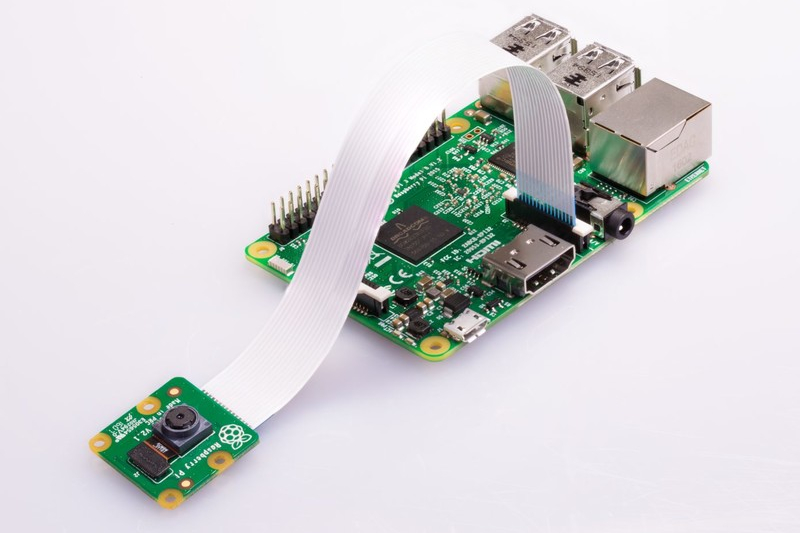

# Camera Module



The Raspberry Pi Camera Modules are official products from the Raspberry Pi Foundation.

The original 5-megapixel model was [released](https://www.raspberrypi.org/blog/camera-board-available-for-sale/) in 2013, and an 8-megapixel [Camera Module v2](https://www.raspberrypi.org/products/camera-module-v2/) was [released](https://www.raspberrypi.org/blog/new-8-megapixel-camera-board-sale-25/) in 2016. For both iterations, there are visible light and infrared versions.

A 12-megapixel [High Quality Camera](https://www.raspberrypi.org/products/raspberry-pi-high-quality-camera/) was [released](https://www.raspberrypi.org/blog/new-product-raspberry-pi-high-quality-camera-on-sale-now-at-50/) in 2020. There is no infrared version of the HQ Camera, however the IR Filter can be removed if required.

## Enabling the camera

Open the `raspi-config` tool from the Terminal:

```bash
sudo raspi-config
```

Select 5 Interfacing Options > P1 Camera. Choose Yes then Ok. Go to Finish and you'll be prompted to reboot.

## Basic usage

### raspistill

Command line tool for capturing still photographs with the camera module.

Enter the following command in the Terminal to take a picture:

```bash
raspistill -o cam.jpg
```

Vertical Flip `-vf` & Horizontal Flip `hf`:

```bash
raspistill -vf -hf -o cam2.jpg
```

### raspivid

Command line tool for capturing video with the camera module.

Record a video using the following command:

```bash
raspivid -o vid.h264
```

To specify the length of the video taken, pass in the `-t` flag with a number of milliseconds:

```bash
raspivid -o video.h264 -t 10000
```

The easiest way to obtain an MP4 file from the `raspivid` command is using `MP4Box`:

```bash
sudo apt install gpac
```

Capture your raw video with raspivid and wrap it in an MP4 container like this:

```bash
# Capture 30 seconds of raw video at 640x480 and 150kB/s bit rate into a pivideo.h264 file:
raspivid -t 30000 -w 640 -h 480 -fps 25 -b 1200000 -p 0,0,640,480 -o pivideo.h264

# Wrap the raw video with an MP4 container:
MP4Box -add pivideo.h264 pivideo.mp4

# Remove the source raw file, leaving the remaining pivideo.mp4 file to play
rm pivideo.h264
```

### Time-lapse

To create a time-lapse video, you simply configure the Raspberry Pi to take a picture at a regular interval, such as every minute, then use an application to stitch the pictures together into a video.

The `raspistill` application has a built in time-lapse mode, using the `--timelapse` (or `-tl`) command line switch.

The value that follows the switch is the time between shots in milliseconds.

```bash
raspistill -t 30000 -tl 2000 -o image%04d.jpg
```

Note the `%04d` in the output filename: this indicates the point in the filename where you want a frame count number to appear.

### raspiyuv

It has the same set of features as raspistill but instead of outputting standard image files such as `.jpgs`, it generates `raw` unprocessed image files from the camera.

## References

[1] Raspberry Pi. [Getting started with the Camera Module](https://projects.raspberrypi.org/en/projects/getting-started-with-picamera).

[2] [Picamera](https://picamera.readthedocs.io/).
