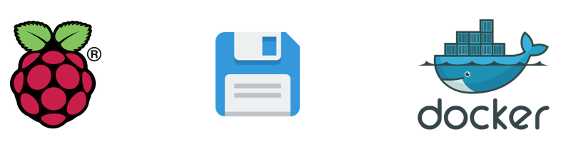

# Clone and shrink a Raspberry Pi image



**WARNING** The use of the `dd` tool can overwrite any partition of your machine. If you specify the wrong device in the instructions, you could overwrite your primary partition!

## Linux

### Determine SD device

First use `fdisk` to get the device id of you SD card (check the size):

```bash
sudo fdisk -l
```

### Copy SD card using dd

Use the dd command to write the image to your hard disk:

```bash
time sudo dd if=/dev/sdb of=${HOME}/Downloads/rpi-clone.img && sync
```

The `if` parameter (input file) specifies the file to clone. In this example, it is `/dev/sdb`, which is the SD card's device name. Replace it with the device name of yours. The `of` parameter (output file) specifies the file name to write to.

## macOS

### Determine SD device

Connect the SD card reader with the SD card inside and run the following command:

```bash
diskutil list
```

```bash
/dev/disk0 (internal, physical):

/dev/disk1 (synthesized):

/dev/disk2 (external, physical):
    #:                     TYPE NAME    SIZE       IDENTIFIER
    0:   FDisk_partition_scheme        *31.9 GB    disk2
    1:           Windows_FAT_32 boot    268.4 MB   disk2s1
    2:                    Linux         31.6 GB    disk2s2
```

### Copy SD card using dd

The disk must be unmounted before copying the image:

```bash
# This example uses /dev/disk2
diskutil unmountDisk /dev/disk2
```

Copy the image:

```bash
time sudo dd if=/dev/rdisk2 of=${HOME}/Downloads/rpi-clone.img && sync
```

Replace `disk2` with the number that you noted before. Note the `rdisk` ('raw disk') instead of disk, this speeds up the copying.

### Eject the SD card

After the `dd` command finishes, eject the card:

```bash
sudo diskutil eject /dev/rdisk2
```

## Shrink the image using PiShrink-docker

[PiShrink-docker](https://github.com/monsieurborges/pishrink-docker) automatically shrink a Raspberry Pi image in order to reduce the final image size.

1. Install Docker following the [Get Docker](https://docs.docker.com/get-docker/) instructions.

2. Using the Terminal, access the directory containing the Raspberry Pi image:

    ```bash
    cd ~/Directory-with-RPi-image
    ```

2. Run PiShrink dockerized:

    ```bash
    docker run --privileged=true --rm \
        --volume $(pwd):/workdir \
        monsieurborges/pishrink \
        pishrink -Zv IMAGE.img NEW-IMAGE.img
    ```

## References

[1] [PiShrink](https://github.com/Drewsif/PiShrink) by
Drew Bonasera.

[2] [PiShrink-docker](https://github.com/monsieurborges/pishrink-docker) by Monsieur Borges.
