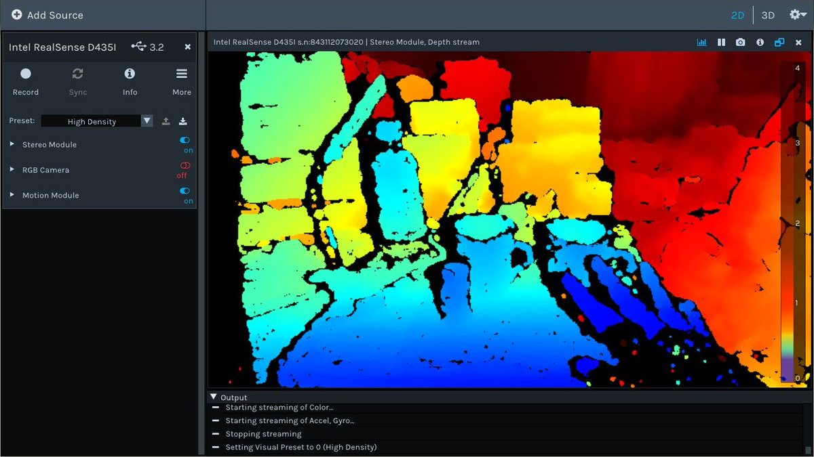

# Installing Intel RealSense Library


## Install dependencies

Start with updating, upgrading, and installing dependencies and tools:

```bash
sudo apt-get update
```

```bash
sudo apt-get dist-upgrade
```

```bash
sudo apt-get install \
    automake libtool cmake \
    libusb-1.0-0-dev libx11-dev \
    xorg-dev libglu1-mesa-dev
```

## Increase the Raspberry Pi SWAP

Before the compile process, it is recommended to increase the swap space. More swap space enables to compile LibRealSense with all cores of the Raspberry Pi without having problems due to full memory.

Edit and restart the swap service:

```bash
sudo sed -i 's/CONF_SWAPSIZE=100/CONF_SWAPSIZE=2048/g' /etc/
dphys-swapfile
```

```bash
sudo /etc/init.d/dphys-swapfile stop
```

```bash
sudo /etc/init.d/dphys-swapfile start
```

## Install Protobuf

Download Protobuf:

```bash
cd ${HOME}
git clone --depth=1 -b v3.12.3 https://github.com/google/protobuf.git
```

Configure Protobuf:

```bash
cd ${HOME}/protobuf
```

```bash
./autogen.sh
./configure
```

Compile Protobuf:

```bash
make -j4
```

Install Protobuf:

```bash
sudo make install
```

Compile Protobuf for Python:

```bash
cd ${HOME}/protobuf/python
```

```bash
export LD_LIBRARY_PATH=../src/.libs
export PROTOCOL_BUFFERS_PYTHON_IMPLEMENTATION=cpp
export PROTOCOL_BUFFERS_PYTHON_IMPLEMENTATION_VERSION=3
```

```bash
python3 setup.py build --cpp_implementation
```

```bash
sudo python3 setup.py install --cpp_implementation
```

```bash
sudo ldconfig
```

```bash
protoc --version
```

## Install `libtbb-dev` parallelism library for C++

```bash
sudo apt-get install libtbb-dev
```

## Install LibRealSense

Clone the Intel LibRealSense:

```bash
cd ${HOME}
git clone https://github.com/IntelRealSense/librealsense.git
```

Apply the `udev` rules:

```bash
cd ${HOME}/librealsense
sudo cp config/99-realsense-libusb.rules /etc/udev/rules.d/
```

Apply the change (needs to be run by root):

```bash
sudo su
udevadm control --reload-rules && udevadm trigger
exit
```

Modify the path by adding the following line to the `.bashrc` file:

```bash
export LD_LIBRARY_PATH=/usr/local/lib:$LD_LIBRARY_PATH
source ${HOME}/.bashrc
```

Build the Intel LibRealSense library:

```bash
cd ${HOME}/librealsense
mkdir build  && cd build
```

```bash
cmake .. \
    -DCMAKE_BUILD_TYPE=Release \
    -DENABLE_CCACHE=ON \
    -DBUILD_EXAMPLES=ON \
    -DBUILD_GRAPHICAL_EXAMPLES=ON \
    -DBUILD_PYTHON_BINDINGS=ON \
    -DFORCE_RSUSB_BACKEND=ON
```

```bash
make -j4
```

Install library:

```bash
sudo make install
```

Modify the path by adding the following line to the `.bashrc` file:

```bash
export PYTHONPATH=$PYTHONPATH:/usr/local/lib

source ~/.bashrc
```

## Install OpenGL

```bash
sudo apt-get install python-opengl
```

```bash
sudo -H pip3 install pyopengl
sudo -H pip3 install pyopengl_accelerate==3.1.3rc1
```

Change Pi settings (enable OpenGL):

```bash
sudo raspi-config
```

Menu 7 Advanced Options > A8 GL Driver > G2 GL (Fake KMS).

## Reset the the Raspberry Pi SWAP

> Remember to go back and reset the swap size:

```bash
sudo sed -i 's/CONF_SWAPSIZE=2048/CONF_SWAPSIZE=100/g' /etc/dphys-swapfile
```

```bash
sudo /etc/init.d/dphys-swapfile stop
sudo /etc/init.d/dphys-swapfile start
```

We enabled a large swap only to compile LibRealSense. It is not prudent to keep a large swap size for a long time. Increasing swap size is a great way to burn out your SD card. Flash-based storage have limited number of writes you can perform until the card is essentially unable to keep the recorded data.

## Test LibRealSense

Connect to the Raspberry Pi and run the built-in viewer from a terminal window:

```bash
realsense-viewer
```



## References

[1] [Raspberry Pi 4 and Intel RealSense D435](https://github.com/acrobotic/Ai_Demos_RPi) by Acrobotic Raspi Demos.

[2] Shane Pfaffly. [How to change Raspberry Pi's Swapfile Size on Raspbian](https://www.bitpi.co/2015/02/11/how-to-change-raspberry-pis-swapfile-size-on-rasbian/). BitPi.co . February 11, 2015.
