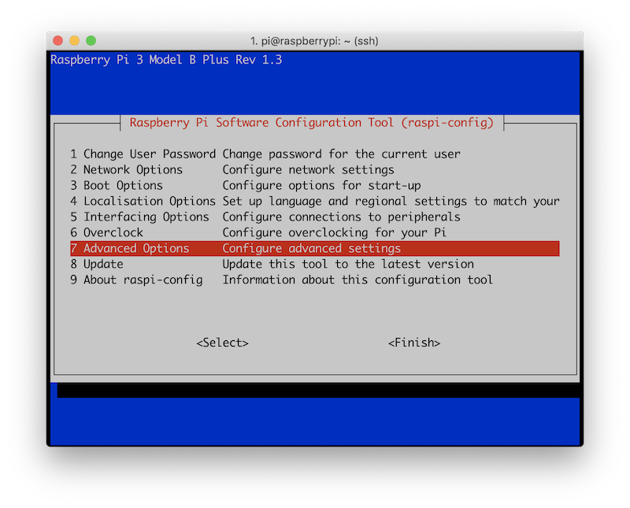
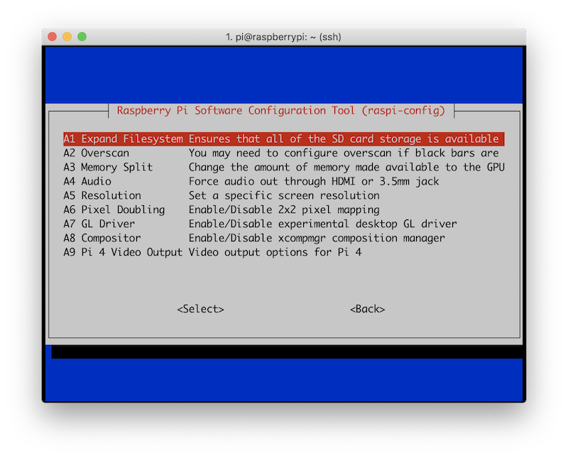

# Installing the Raspberry Pi OS

This resource explains how to install and set up the Raspberry Pi OS. Before you start, don't forget to check the [requirements](./requirements.md).


## Install the Raspberry Pi OS

Raspberry Pi have developed a graphical SD card writing tool that works on macOS, Linux and Windows.

It is the easiest option for most users as it will download the Raspberry Pi image and install it automatically to the SD card.


For this tutorial, we use the Raspberry Pi OS (32-bit) with desktop and recommended software.

1. Download the latest version of [Raspberry Pi Imager](https://www.raspberrypi.org/downloads/) and install it.
2. Connect an SD card reader with the SD card inside.
3. Open Raspberry Pi Imager and choose the required OS from the list presented.
4. Choose the SD card you wish to write your image to.
5. Review your selections and click **WRITE** to begin writing data to the SD card.

## Enable SSH

SSH is disabled by default (check [Raspberry Pi release notes](http://downloads.raspberrypi.org/raspbian/release_notes.txt)). It can be enabled by creating a file with name `ssh` in boot partition.

To enable SSH connection, paste at a terminal prompt:

```bash
# /Volumes/boot/ => Path/to/SD_card
touch /Volumes/boot/ssh
```

## Set up the WiFi

In boot partition, create a `wpa_supplicant.conf` file with the content below.

Copy and paste the block of commands replacing `ssid`, `psk`, and `country` with your informations:

```bash
# Define the wpa_supplicant.conf file
read -r -d '' WPA <<"EOF"
ctrl_interface=DIR=/var/run/wpa_supplicant GROUP=netdev

update_config=1
country=FR

network={
    ssid="YOUR-SSID-1"
    psk="YOUR-PASSWORD"
    scan_ssid=1
    priority=1
}

network={
    ssid="YOUR-SSID-2"
    psk="YOUR-PASSWORD"
    scan_ssid=1
    priority=5
}
EOF
```

```bash
# Create the wpa_supplicant.conf file
# /Volumes/boot/ => Path/to/SD_card
echo "${WPA}" > /Volumes/boot/wpa_supplicant.conf
```

* `ssid`: your network's SSID
*  `psk`: your network's password
*  `priority`: network priority
* `country`: [ISO two-letter country code](https://en.wikipedia.org/wiki/ISO_3166-1_alpha-2):
  * GB (United Kingdom)
  * FR (France)
  * DE (Germany)
  * US (United States)
  * SE (Sweden)

## Boot Raspberry Pi OS

If you are using an HDMI screen and a USB keyboard, ensure they are plugged in before powering the Pi.

If you are running the Pi headless (without a display), you need to connect to it remotely from your laptop.

Insert the SD card into the Pi and power it up. After a minute or so, Raspberry Pi OS will have fully booted and connected to the network.

## Remote Access

To connect to your Raspberry Pi remotely, you need two things:

* Its IP address on the local network
* An SSH client

For more details, check out the resource [Accessing your Pi remotely via SSH or VNC](./remote-access.md).

## Configuring the Raspberry Pi

Setup your timezone:

```bash
sudo dpkg-reconfigure tzdata
```

Make sure the OS is up to date:

```bash
sudo apt-get update
sudo apt-get upgrade
```

You can optionally proceed to make other tweaks using the `raspi-config`:

```bash
sudo raspi-config
```

## Expand filesystem

Expand the Raspberry Pi filesystem to include all available space on teh SD card:

```bash
 sudo raspi-config
```

And then select the "Advanced Options" menu item:



Followed by selecting "Expand filesystem":



Once prompted, you should select the first option, "A1. Expand File System" and hit `Enter` on your keyboard.

Then, arrow down to the `<Finish>` button, and then reboot the Raspberry Pi. You may be prompted to reboot, but if you aren't you can execute:

```bash
sudo reboot
```

After rebooting, the file system should have been expanded to include all available space on the SD card.

Verify if the disk has been expanded by executing `df -h` and examining the output:

```bash
pi@raspberrypi:~ $ df -h
Filesystem      Size  Used Avail Use% Mounted on
/dev/root        29G  1.2G   27G   5% /
devtmpfs        459M     0  459M   0% /dev
tmpfs           464M     0  464M   0% /dev/shm
tmpfs           464M  6.2M  457M   2% /run
tmpfs           5.0M  4.0K  5.0M   1% /run/lock
tmpfs           464M     0  464M   0% /sys/fs/cgroup
/dev/mmcblk0p1  253M   40M  213M  16% /boot
tmpfs            93M     0   93M   0% /run/user/1000
```

In this example, the Raspbian filesystem has been expanded to include all 32GB of the SD card.

## Perl warning setting locale failed on Raspbian

You can fix the issue by setting the locale to `en_US.UTF-8`, `en_GB.UTF-8`, or `en_FR.UTF-8` for example:

```bash
export LANGUAGE=en_GB.UTF-8
export LANG=en_GB.UTF-8
export LC_ALL=en_GB.UTF-8
sudo locale-gen en_GB.UTF-8
sudo dpkg-reconfigure locales
```

## References

[1] [Setting up your Raspberry Pi](https://projects.raspberrypi.org/en/projects/raspberry-pi-setting-up).

[2] [Raspberry Pi Documentation](https://github.com/raspberrypi/documentation).
