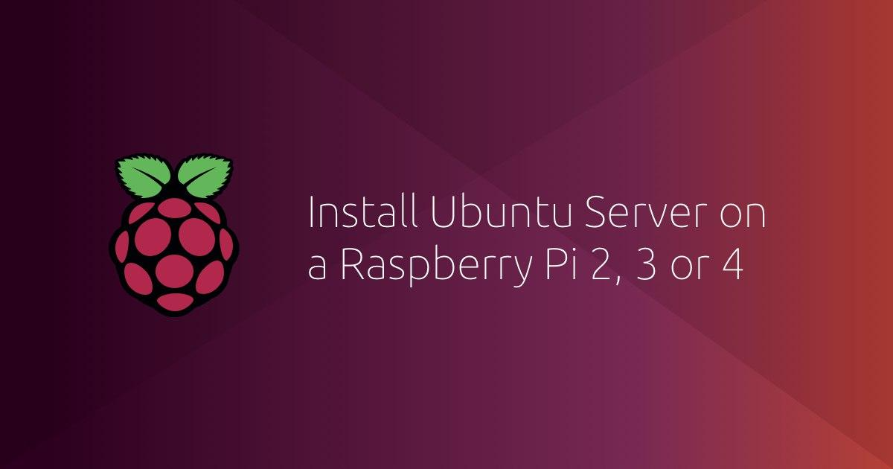

# Installing Ubuntu Server

This resource explains how to install and set up Ubuntu Server on a Raspberry Pi. Before you start, don't forget to check the [requirements](./requirements.md).



## Install Ubuntu Server

Raspberry Pi have developed a graphical SD card writing tool that works on macOS, Linux and Windows.

It is the easiest option for most users as it will download the Raspberry Pi image and install it automatically to the SD card.


1. Download the latest version of [Raspberry Pi Imager](https://www.raspberrypi.org/downloads/) and install it.
2. Connect an SD card reader with the SD card inside.
3. Open Raspberry Pi Imager and open the **CHOOSE OS** menu.
4. Scroll down the menu click **Ubuntu**, then select **Ubuntu 20.04.1 LTS (RASPBERRY PI 2/3/4)**.
5. Choose the SD card you wish to write your image to.
6. Review your selections and click **WRITE** to begin writing data to the SD card.

## Wi-Fi or Ethernet

There are two ways to get your Pi connected to the internet:

* The first is to connect your Pi to your router with an ethernet cable. In this case, you can skip this step and go to the next one in the tutorial.
* The second requires a local Wi-Fi network that both your computer and Pi can be connected to. We are going to edit files you just downloaded on your SD card to ensure your Pi can connect to the Wi-Fi network at boot.

### Getting setup with Wi-Fi

With the SD card still inserted in your laptop, open a file manager and locate the "system-boot" partition on the card. It contains initial configuration files that will be loaded during the first boot.

Edit the network-config file to add your Wi-Fi credentials. An example is already included in the file, you can simply adapt it.

For example:

```bash
wifis:
  wlan0:
  dhcp4: true
  optional: true
  access-points:
    "My-home-network":
      password: "123456789"
```

Save the file and extract the card from your laptop. During the first boot, your Raspberry Pi will automatically connect to this network.

## Boot Ubuntu Server

If you are using an HDMI screen and a USB keyboard, ensure they are plugged in before powering the Pi.

If you are running the Pi headless (without a display), you need to connect to it remotely from your laptop.

Insert the SD card into the Pi and power it up. After a minute or so, Raspberry Pi OS will have fully booted and connected to the network.

## Remote Access

To connect to your Raspberry Pi remotely, you need two things:

* Its IP address on the local network
* An SSH client

For more details, check out the resource [Accessing your Pi remotely via SSH or VNC](./remote-access.md).

## Install a desktop

Depending on what you are going to use your Pi for, you may want a desktop environment to run graphical applications. Nevertheless, this step is completely optional.

First you need to ensure your packages are updated to the latest version, run:

```bash
sudo apt update
sudo apt upgrade
```

Then, you can use the `apt install` command to install a desktop environment.

Here are some popular and lightweight options:

* ubuntu-desktop
* xubuntu-desktop
* lubuntu-desktop
* kubuntu-desktop

```bash
sudo apt install ubuntu-desktop
```

Learn more about [Ubuntu flavours](https://ubuntu.com/download/flavours).

Once the install finishes, reboot your pi with:

```bash
sudo reboot
```

For more details about Raspberry Pi specific packages included with this image and further customisations, such as accelerated video drivers and optional package repositories, you can refer to the [RaspberryPi wiki](https://wiki.ubuntu.com/ARM/RaspberryPi?&_ga=2.128250052.933902139.1597147896-1929488075.1597147896#Packages).

## References

[1] [How to install Ubuntu on your Raspberry Pi](https://ubuntu.com/tutorials/how-to-install-ubuntu-on-your-raspberry-pi).
