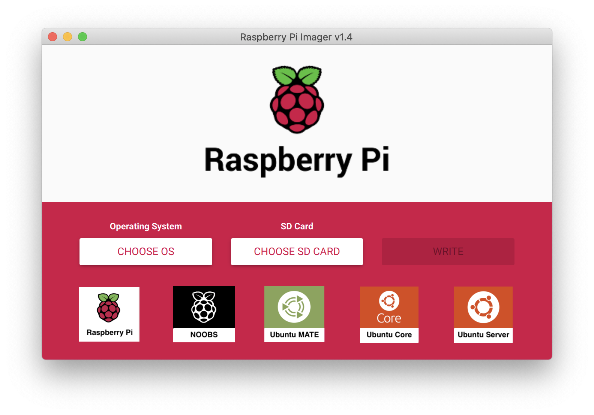
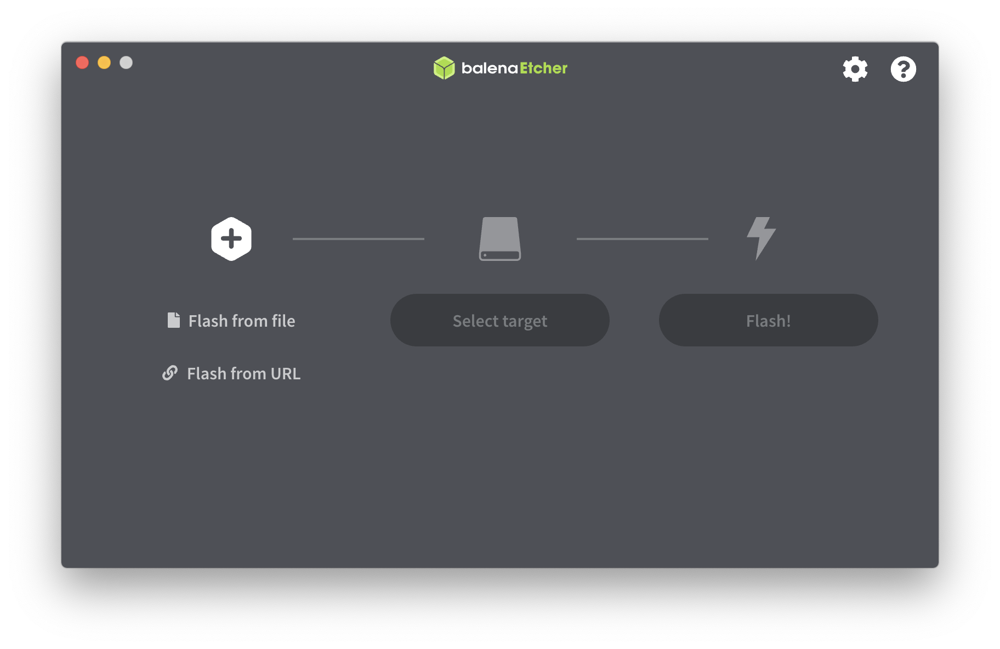

# Installing operating system images

You need an image writing tool to install a Raspberry Pi operating system on an SD card.

The most used tools are:

* [Raspberry Pi Imager](https://www.raspberrypi.org/downloads/)
* [balenaEtcher](https://www.balena.io/etcher/)

## Install using the Raspberry Pi Imager

Raspberry Pi have developed a graphical SD card writing tool that works on macOS, Linux and Windows.

It is the easiest option for most users as it will download the image and install it automatically to the SD card.

1. Download the latest version of [Raspberry Pi Imager](https://www.raspberrypi.org/downloads/) and install it.
2. Connect an SD card reader with the SD card inside.
3. Open Raspberry Pi Imager and choose the required OS from the list presented.
4. Choose  the SD card you wish to write your image to.
5. Review your selections and click **WRITE** to begin writing data to the SD card.

## Install using balenaEtcher

[balenaEtcher](https://www.balena.io/etcher/) is a graphical SD card writing tool that works on macOS, Linux and Windows.

1. Download [balenaEtcher](https://www.balena.io/etcher/) and install it.
2. Connect an SD card reader with the SD card inside.
3. Download an [Official Raspberry Pi image](https://www.raspberrypi.org/downloads)
   * [NOOBS](https://www.raspberrypi.org/downloads/noobs/)
   * [Raspberry Pi OS](https://www.raspberrypi.org/downloads/raspberry-pi-os/)
   * [Ubuntu MATE](https://ubuntu-mate.org/ports/raspberry-pi/)
   * [Ubuntu Core](https://ubuntu.com/download/raspberry-pi-core)
   * [Ubuntu Server](https://ubuntu.com/download/raspberry-pi)
4. Open balenaEtcher and select from your hard drive the `.img` or `.zip` file you wish to write to the SD card.
5. Select the target SD card you wish to write your image to.
6. Review your selections and click **Flash!** to begin writing data to the SD card.
