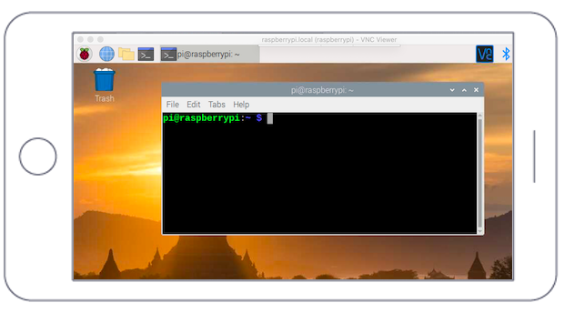
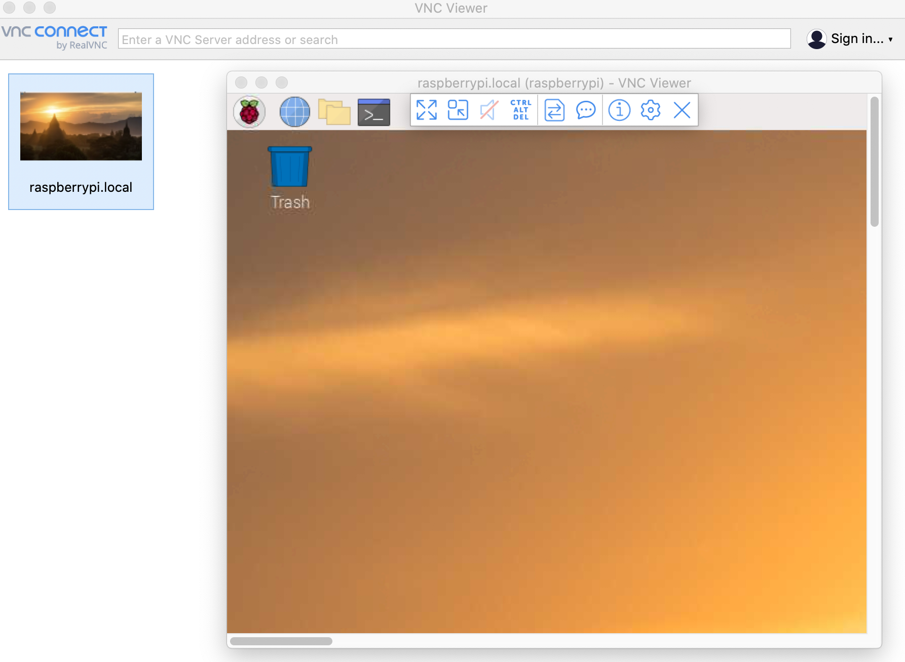

# Remote Access

This resource explains how to access your Raspberry Pi remotely.

## IP address

Any device connected to a Local Area Network (LAN) is assigned an IP address.

In order to connect to your Raspberry Pi from another machine using SSH or VNC, you need to know the Pi's IP address.

### Using the Pi with a display

Using the Pi Terminal, simply type `hostname -I` which will reveal your Pi's IP address.

### Using the Pi headless (without a display)

By default, you can reach your Raspberry Pi by using the address `raspberrypi.local`:

```bash
ping raspberrypi.local
```

If the Raspberry Pi is reachable, ping will show its IP address:

```bash
PING raspberrypi.local (192.168.1.23): 56 data bytes
64 bytes from 192.168.1.23: icmp_seq=0 ttl=64 time=2.618 ms
```

You can also use the `arp` command.

* To find a Raspberry Pi 3:

  ```bash
  arp -na | grep -i "b8:27:eb"
  ```

* To find a Raspberry Pi 4:

  ```bash
  arp -na | grep -i "dc:a6:32"
  ```

## SSH - Secure Shell

On Linux and macOS, an SSH client is already installed. Some versions of Windows 10 also include an SSH client too, but if yours does not or you're unsure, follow [these steps](https://docs.microsoft.com/en-us/windows-server/administration/openssh/openssh_install_firstuse) to install one.

To connect via SSH, open a terminal and run the following command:

```bash
# ssh pi@<Raspberry Pi IP address>
ssh pi@raspberrypi.local
```

You will be asked to confirm the connection:

```bash
"Are you sure you want to continue connecting" (yes/no/[fingerprint])?
```

Type "yes" to confirm. The default password is `raspberry`.

If you encounter the following error:

```bash
@@@@@@@@@@@@@@@@@@@@@@@@@@@@@@@@@@@@@@@@@@@@@@@@@@@@@@@@@@@
@       WARNING: POSSIBLE DNS SPOOFING DETECTED!          @
@@@@@@@@@@@@@@@@@@@@@@@@@@@@@@@@@@@@@@@@@@@@@@@@@@@@@@@@@@@
@    WARNING: REMOTE HOST IDENTIFICATION HAS CHANGED!     @
@@@@@@@@@@@@@@@@@@@@@@@@@@@@@@@@@@@@@@@@@@@@@@@@@@@@@@@@@@@
```

Then simply edit your `.ssh/known_hosts` file and remove the line that has the Raspberry Pi entry.

## VNC - Virtual Network Computing

Sometimes it is not convenient to work directly on the Raspberry Pi. Maybe you would like to work on it from another device by remote control.

VNC is a graphical desktop sharing system that allows you to remotely control the desktop interface of one computer (running VNC Server) from another computer or mobile device (running VNC Viewer). VNC Viewer transmits the keyboard and either mouse or touch events to VNC Server, and receives updates to the screen in return.



### Installing VNC

VNC is already installed on the full Raspberry Pi OS image. If you are not using a desktop you can install it from the command line:

```bash
sudo apt update
sudo apt install realvnc-vnc-server realvnc-vnc-viewer
```

### Enabling VNC Server

You can do this graphically or at the command line.

* **Enabling VNC Server graphically**
  * On your Raspberry Pi, boot into the graphical desktop.
  * Select Menu > Preferences > Raspberry Pi Configuration > Interfaces.
  * Ensure VNC is Enabled.

* **Enabling VNC Server at the command line**
  * You can enable VNC Server at the command line using raspi-config:

    ```bash
    sudo raspi-config
    ```

  * Navigate to Interfacing Options.
  * Scroll down and select VNC > Yes.

### Connecting to your Raspberry Pi with VNC Viewer

You can connect to your Raspberry Pi using the [VNC Viewer](https://www.realvnc.com/en/connect/download/viewer/) by RealVNC.


