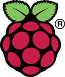
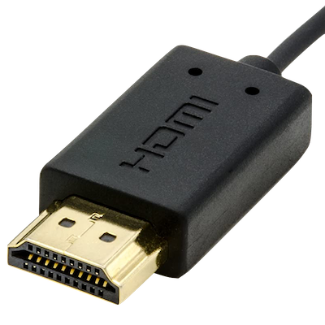
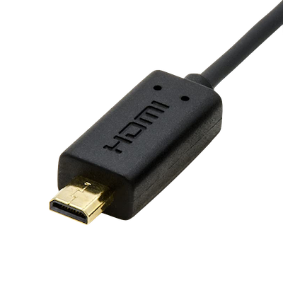
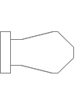
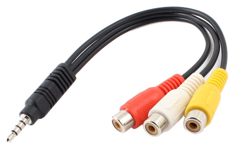
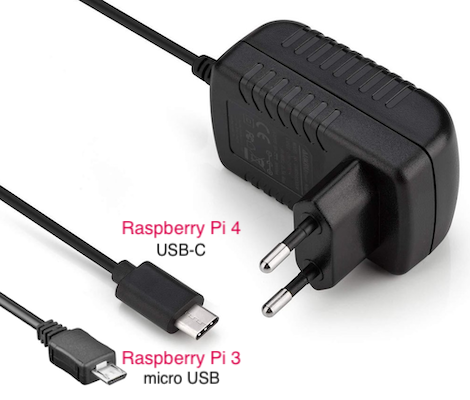

# Requirements

A guide to setting up your Raspberry Pi (RPi) and what you will need to get started.

## SD card

We recommend a microSD card with the following minimum specifications:

* 16GB memory card
* Speed class 10
* UHS speed class 3 (U3)
* Application class 1 (A1)

### SD Speed Classes

SD Speed Classes indicate the minimum writing speed.

1. **Speed class**: a number like 2, 4, 6, and 10 indicates the minimum write speed in MB/s.

2. **UHS Speed Class**: this stands for Ultra High Speed and refers to minimum sustained writing performance for recording video. There are two classes: Class 1 (U1) and Class 3 (U3). UHS Speed Class 1 supports a minimum 10MB/s write speed, whereas UHS Speed Class 3 supports at least 30MB/s write speed.

3. **Video Speed Class**: is defined by V6, V10, V30, V60 and V90, where the number represents the speed in MB/s.

### Application Performance Class

Application Performance Class defines the performance according to the type of operation. It defines different priorities for storing maps, pictures, videos, music, dictionary and documents. It also guarantees priorities for editing and updating data.

The table below describes outline of the Application Performance Class 1 (A1) and Class 2 (A2) specification including Pictograph, the minimum average of random read/write IOPS (Input-Output access per second), and the minimum sustained sequential performance (MB/s).

## Display cable

Any HDMI/DVI monitor or TV should work as a display for the Raspberry Pi.

* [Raspberry Pi 3](https://www.raspberrypi.org/products/raspberry-pi-3-model-b-plus/) - **HDMI connector**

    

* [Raspberry Pi 4](https://www.raspberrypi.org/products/raspberry-pi-4-model-b/) - **micro HDMI connector**

    

## Audio 4-pole jack cable

The Raspberry Pi Model B+, Pi 2, Pi 3 and Pi 4 features a 4-pole 3.5mm socket which carries both audio and video signals.

Cables are readily available but they don't all follow the same standard so you need to be careful before assuming it will work with your Raspberry Pi.

The four conductors carry video, ground, right audio and left audio.

| Device                                 | Sleeve                                    | Ring 2                                    | Ring 1                                    | Tip                                |
| -------------------------------------- | ----------------------------------------- | ----------------------------------------- | ----------------------------------------- | ---------------------------------- |
|  |  |  |  |  |
|                                        | 4                                         | 3                                         | 2                                         | 1                                  |
| RPi 3 & 4                              | Video                                     | Ground                                    | Right                                     | Left                               |

## Keyboard and mouse

Any standard USB keyboard and mouse will work with the Raspberry Pi. Wireless keyboards and mouse will work if already paired.

## Power supply

You need a power supply that can supply at least 3A at 5V.

Raspberry Pi Power supply connector:

* RPi 3 - **micro USB**
* RPi 4 - **USB-C**

## Ethernet network cable

An Ethernet cable is used to connect your Raspberry Pi to a local network and the Internet.
